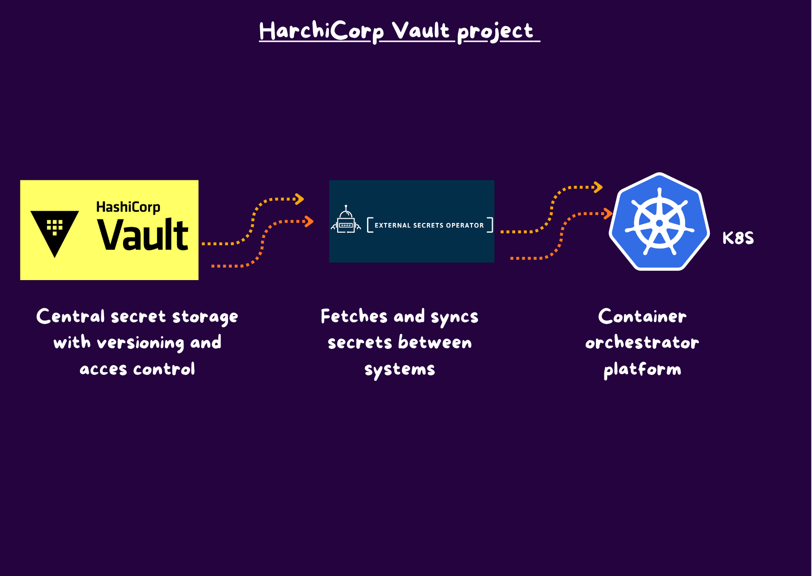
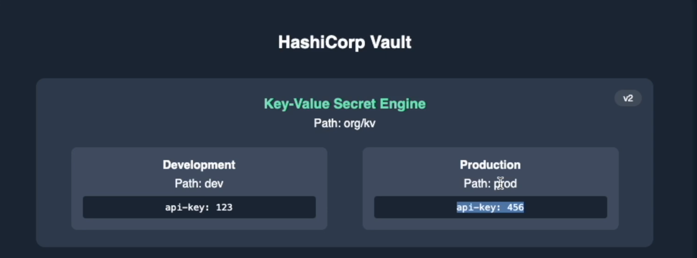
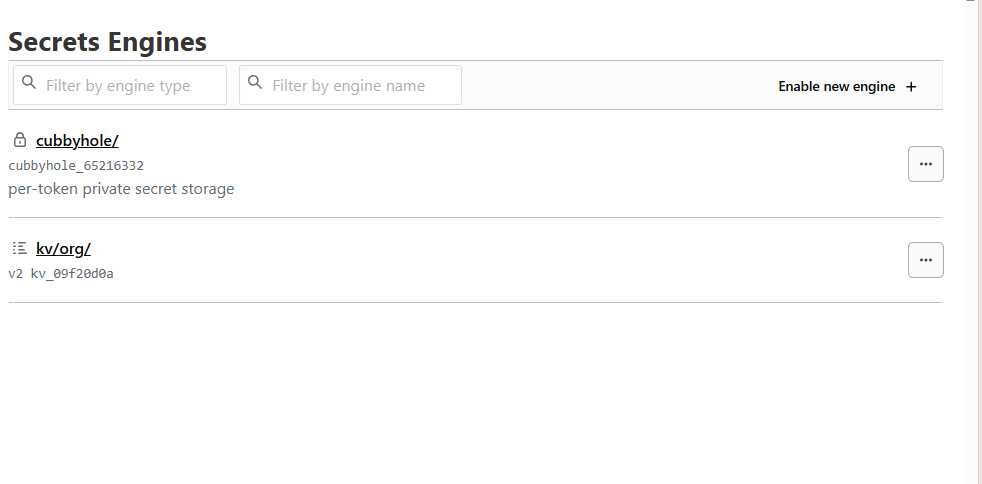
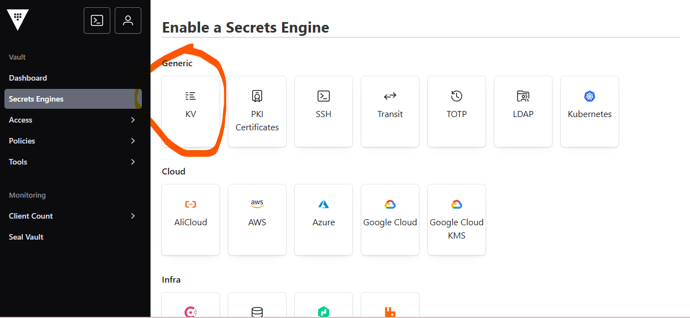
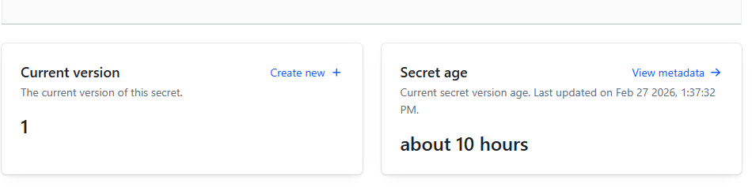
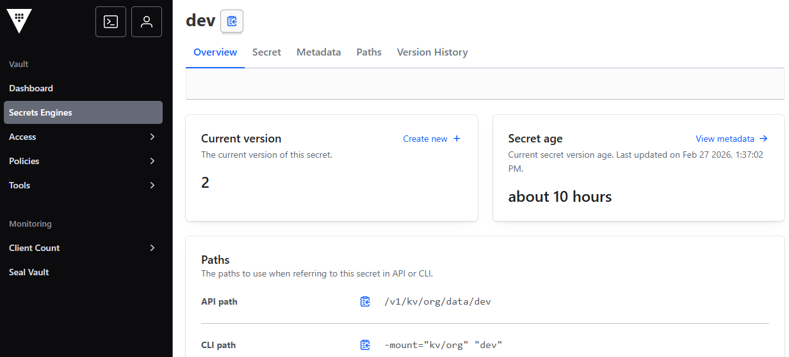
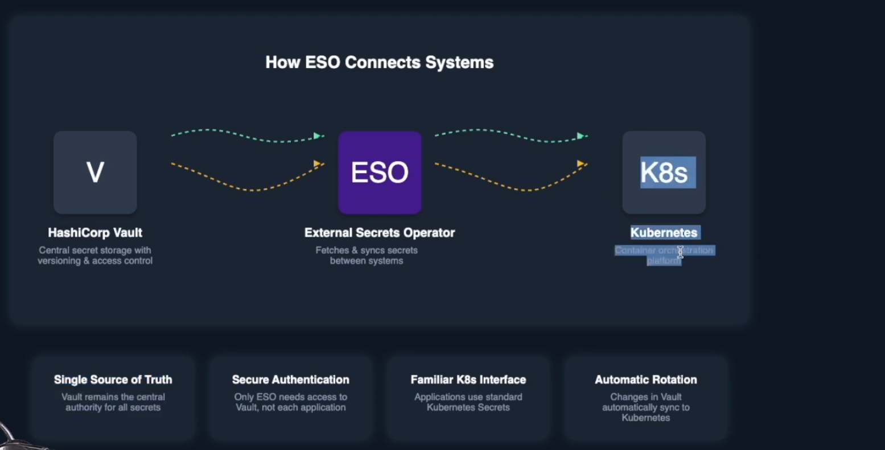

# Vault External Secrets Tutorial

  <div align="center">
        
  </div>

## Prerequisites

To follow along with this tutorial, you'll need:

- kubectl installed and configured ([https://youtu.be/IBkU4dghY0Y](https://youtu.be/IBkU4dghY0Y))
- Helm installed: [https://rslim087a.github.io/rayanslim/lesson.html?course=prometheus-grafana-monitoring-course&lesson=helm-installation](https://rslim087a.github.io/rayanslim/lesson.html?course=prometheus-grafana-monitoring-course&lesson=helm-installation)


## Description 

 This tutorial is a hands-on guide that shows how to securely sync secrets from HashiCorp Vault into Kubernetes using External Secrets. It walks through setup, configuration, and end-to-end integration so applications can consume secrets without hardcoding credentials or storing sensitive values directly in manifests. The project is focused on practical, reproducible steps for local learning and real-world implementation patterns.

 i use :
 - KInd for the K8s cluster
 - ESO to connect k8s to vault server
 - Vault for secret management
 this set up wil automatically deploy secret to k8s base on value storage in Vault.

## Run Vault server

we will use the docker compose file to set up our server.

```yaml
services:
  vault:
    image: hashicorp/vault:1.19.0
    container_name: vault
    ports:
      - "8200:8200"    #listening port
    environment:
      - VAULT_DEV_ROOT_TOKEN_ID=root
      - VAULT_DEV_LISTEN_ADDRESS=0.0.0.0:8200
    cap_add:
      - IPC_LOCK
    command: server -dev
```

when your container is up, browse : localhost:8200 to connet to your vault server
before connection, please install the ESO and configure Authentication for vault.

## Creating Authentication for Vault

we create a secret that we will use to authenticate to the vault server.

```bash
# Create a namespace for our demo
kubectl create namespace demo

# Create a Kubernetes secret with the Vault token
kubectl create secret generic vault-token \
  --namespace demo \
  --from-literal=token=root
  ```

## Acces your app

browse : localhost:8200 to connet to your vault server
enter "root" as your token.

## HarchiCorp Vault
  <div align="center">
        
  </div>
wi will use a Key value type to store our secret for dev and prod env.

you migth see per-token secrete storage and key-value secret.
we use KV, delete the default one .
we create a new KY secret.

clic "create new engine"
  <div align="center">
        
  </div>

configure the path "kv/org"
version 3: this field specify the number of version that will be kept for each secret
  <div align="center">
        
  </div>
enable engine

- click on our path
- crete new secrete 
- path "dev"
- key=api-key ; value=123
- click add save it
 <div align="center">
        
  </div>
this version is setted to 1 . if we up grade our secret, the version will be 2.
modify our value to 456

 <div align="center">
        
  </div>
 you create the same secret for the prod: 945 as value

  <div align="center">
        
  </div> 


## Install ESO
it allows to synchronise secrete stored in vault for k8s .
```bash
# Add the External Secrets Helm repository
helm repo add external-secrets https://charts.external-secrets.io

# Update Helm repositories
helm repo update

# Install External Secrets Operator
helm install external-secrets external-secrets/external-secrets \
  --namespace external-secrets \
  --create-namespace \
  --version 0.15.0
```

## Secret Synchronization Process

### ClusterSecretStore
Defines a cluster-wide connection to an external secret provider, allowing multiple namespaces to securely reference the same secret backend configuration.

### ExternalSecret
Syncs secrets from an external secret manager (e.g., AWS Secrets Manager, HashiCorp Vault) into Kubernetes, enabling secure and automated secret management.

## Deploy ESO

connect to k8s

```bash

   kubectl apply -f secret-store.yaml
   kubectl get secret vault-token -n demo --o yaml   
   echo "data value" | base64 -d
   kubectl apply -f external-secret-dev.yaml
   kubectl get  es -n demo
   kubectl get secret dev-api-credentials -n demo
   echo "data value" | base64 -d
   kubectl apply -f external-secret-prod.yaml
   kubectl get  es -n demo
   kubectl get secret prod-api-credentials -n demo
   echo "data value" | base64 -d
   kubectl apply -f test-pod.yaml 
   kubectl describe pods -n demo
   kubectl logs api-consumer -n demo
```

## Test using pod

```yaml
apiVersion: v1
kind: Pod
metadata:
  name: api-consumer
  namespace: demo
spec:
  containers:
  - name: api-consumer
    image: busybox
    command: ['sh', '-c', 'echo "Using API Key: $API_KEY" && sleep 3600']
    env:
    - name: API_KEY
      valueFrom:
        secretKeyRef:
          name: dev-api-credentials
          key: api-key
```

